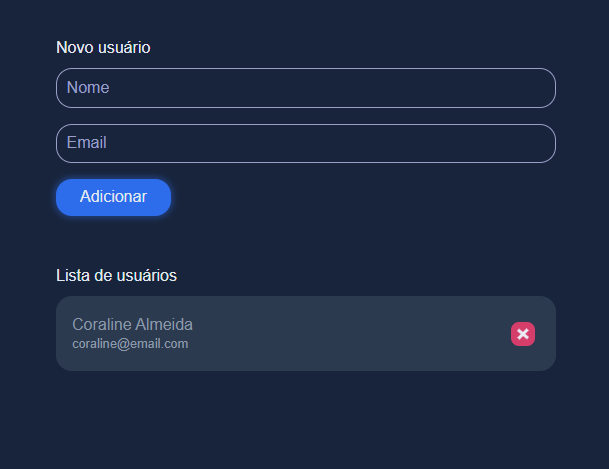

# Estudo nodejs

Projeto realizado para estudo de nodejs e prática de typescript.



## Setup Front-end

### /estudo-nodejs:

```
yarn install
```

or

```
npm install
```

## Setup Back-end

### /estudo-nodejs/api:

```
yarn install
```

or

```
npm install
```

### Compiles and hot-reloads for development

### /estudo-nodejs:

```
yarn dev
```

or

```
npm run dev
```

### /estudo-nodejs/api:

```
yarn start
```

or

```
npm run start
```
